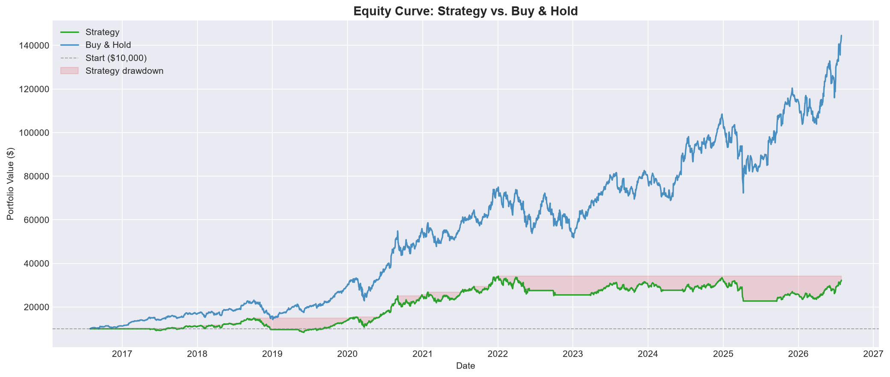
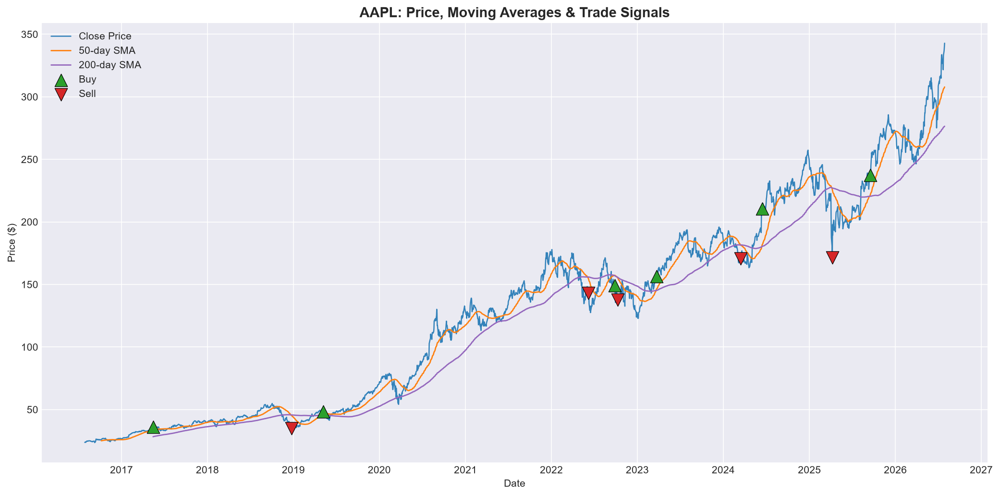

# Momentum Trading Backtester

A from-scratch quantitative backtesting engine built in Python to answer a single, concrete question:

> **Does a classic 50/200-day moving-average momentum strategy beat simply buying and holding the asset?**

The short answer, on 10 years of Apple (AAPL) data: **no — and the *why* is the interesting part.** This project builds the full machinery to test that hypothesis rigorously, benchmarks it honestly against buy-and-hold, and diagnoses exactly why the strategy underperformed.

---

## The Hypothesis

Momentum trading rests on a simple idea borrowed from physics: *an object in motion tends to stay in motion.* Assets that have recently trended up are assumed to keep trending up. The textbook way to trade this is the **moving-average crossover**:

- Compute a fast (50-day) and slow (200-day) moving average of price.
- When the fast average crosses **above** the slow one (a "Golden Cross"), go long.
- When it crosses **below** (a "Death Cross"), exit to cash.

The hypothesis under test: *following these signals should outperform passively holding the asset, or at least deliver a smoother, less risky ride.*

## The Verdict

Backtested on AAPL, July 2016 – July 2026, starting from $10,000:

| Metric | Strategy | Buy & Hold |
|---|---:|---:|
| Cumulative Return | +222.58% | **+1,345.41%** |
| Sharpe Ratio | 0.61 | **1.07** |
| Maximum Drawdown | −44.22% | **−38.52%** |
| Final Equity | $32,258 | **$144,541** |
| Win Rate | 40% (2 of 5 closed trades) | — |

**The strategy lost on every dimension.** It made less money, had worse risk-adjusted returns (lower Sharpe), *and* suffered a **deeper** drawdown than simply holding. The intuition that "sitting in cash during downturns protects you" turned out to be wrong here — and understanding why is the real result of this project.



## Why the Strategy Underperformed

A moving-average crossover is a **lagging** indicator by construction — it confirms trends only *after* they have already turned. On a strongly trending stock in a V-shaped-recovery market, that lag hurts at both ends of every trade:

- **It buys late.** The Golden Cross fires well after the bottom, so entries often land near local highs.
- **It sells late.** The Death Cross fires well after the top, so the strategy rides a chunk of each decline down before exiting.
- **Worst case — it sold low and bought back higher.** During the 2025 selloff the strategy exited near a trough (~$171) and had to re-enter months later at a much higher price (~$237). Buy-and-hold simply held through the dip and recovered.

The strategy's own trade log tells the story: **a 40% win rate carried almost entirely by one enormous winner** (the 2019–2022 hold, worth ~$18,000), with the other trades bleeding money on whipsaws and late exits. That low-win-rate, few-big-winners profile is characteristic of trend-following — but on this asset the winners weren't enough to overcome the cost of the lag.



**This is a well-documented result in quantitative finance**, not a bug. A naive momentum strategy tends to underperform buy-and-hold on a relentlessly rising megacap; it earns its keep instead on choppier or more cyclical assets where sustained trends alternate with crashes it can dodge.

## How It Works

The project is a clean pipeline of five importable modules, one per phase:

| Module | Phase | Responsibility |
|---|---|---|
| `data_pipeline.py` | 1 — Data | Fetch, clean, and cache historical OHLCV data (via `yfinance`), split/dividend-adjusted for correctness. |
| `signals.py` | 2 — Signals | Compute the 50/200-day moving averages and generate Buy/Hold position signals. |
| `engine.py` | 3 — Simulation | Simulate cash and holdings day-by-day, applying realistic frictions and executing trades. |
| `metrics.py` | 4 — Metrics | Compute cumulative return, Sharpe ratio, max drawdown, and win rate for strategy vs. benchmark. |
| `visualise.py` | 5 — Reporting | Produce the price/signal chart and the equity-curve comparison. |

## Key Design Decisions

A few choices were made deliberately to keep the backtest *credible* rather than flattering:

- **No lookahead bias.** A signal computed from day *T*'s close can only be acted on at day *T+1*'s price — you don't know today's close until the market shuts. The engine shifts signals forward one day to enforce this. Skipping it is the single most common backtesting error and produces impressive but unachievable results.
- **Realistic transaction costs.** Every trade pays a percentage cost (spread/slippage that scales with size) *plus* a flat per-trade fee (commission), and fills at a slightly worse price than the close (slippage).
- **Honest benchmarking.** Every metric is reported side-by-side against buy-and-hold, because a return figure means nothing without the "do nothing" alternative to compare it to.
- **Reproducibility.** Downloaded data is cached to CSV, so every run backtests against a frozen dataset and results are comparable across strategy tweaks.

## Installation & Usage

```bash
# 1. Install dependencies
pip install -r requirements.txt

# 2. Run any phase individually (each module has a __main__ demo)
python data_pipeline.py     # fetch & inspect the data
python signals.py           # generate and view signals
python engine.py            # run the simulation
python metrics.py           # print the full performance report
python visualise.py         # generate the charts into figures/
```

Change the ticker (e.g. `"BTC-USD"`, `"MSFT"`) at the top of any module's `__main__` block to backtest a different asset.

## Limitations & Honest Caveats

This is a portfolio-scale backtester, not an institutional one. It deliberately does **not** model market impact (large orders moving the price), intraday fills, short-selling costs, or financing. Calling it "realistic" means *credible and defensible*, not production-grade — and being explicit about those simplifications is itself part of doing quantitative work honestly.

The result is also **asset- and period-specific.** A single backtest on one stock is a data point, not a law. The same strategy on a different asset or timeframe could easily reach the opposite conclusion.

## Possible Extensions

- **Multi-asset comparison** — run the identical pipeline across several tickers (a trending megacap, a choppy cyclical, a crypto asset) and tabulate *where* momentum wins and loses. The functions already parameterise the ticker.
- **Parameter sweep** — the 50/200 window is deliberately slow; faster windows (e.g. 20/100) react quicker with a different risk profile.
- **Additional strategies** — RSI, MACD, or dual-momentum signals could slot into the existing `signals.py` interface.

## Techstack

Built with Python, pandas, NumPy, and Matplotlib.

## License

Released under the MIT license. See 'LICENSE' for details.